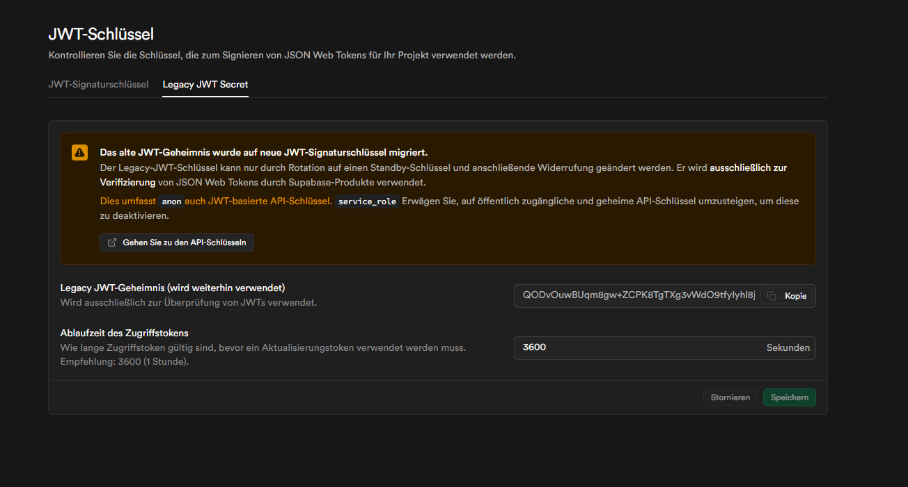

# Supabase Storage Setup (Avatars + Attachments)

Dieses Dokument beschreibt die einmalige Konfiguration deines Supabase-Projekts,
damit Avatare (und spaeter Anhaenge) **nicht mehr als Base64 in der Datenbank**
liegen, sondern als echte Dateien im Object-Storage. Das reduziert Egress um
ca. **85 %** weil Browser sie cachen und der API-Server sie nicht mehr ausliefert.

---

## 1. Storage-Bucket `avatars` anlegen (Public)

Im **Supabase Dashboard**:

1. Linkes Menue → **Storage** → **New bucket**
2. Name: `avatars`
3. Public bucket: **AN** (Avatare sollen ohne Auth direkt geladen werden koennen)
4. File size limit: `2 MB`
5. Allowed MIME types: `image/jpeg, image/png, image/webp, image/gif`
6. **Create bucket**

Alternativ per SQL-Editor:

```sql
insert into storage.buckets (id, name, public, file_size_limit, allowed_mime_types)
values (
  'avatars',
  'avatars',
  true,
  2097152,
  array['image/jpeg','image/png','image/webp','image/gif']
)
on conflict (id) do update set
  public = excluded.public,
  file_size_limit = excluded.file_size_limit,
  allowed_mime_types = excluded.allowed_mime_types;
```

### RLS-Policies fuer den Bucket

Der Service-Role-Key umgeht RLS sowieso — wir schreiben aber trotzdem
restriktive Policies, damit kein anderer Weg Schreibzugriff bekommt:

```sql
-- Lesen: jeder darf Avatare lesen (Public-Bucket)
create policy "avatars_public_read"
on storage.objects for select
to public
using (bucket_id = 'avatars');

-- Schreiben/Loeschen: NIEMAND ausser service_role (das schluepft an RLS vorbei)
-- → einfach keine INSERT/UPDATE/DELETE-Policy fuer authenticated definieren.
```

---

## 2. (Optional, spaeter) Bucket `attachments` (Privat)

```sql
insert into storage.buckets (id, name, public, file_size_limit)
values ('attachments', 'attachments', false, 10485760) -- 10 MB
on conflict (id) do nothing;
```

Privater Bucket → Download nur ueber `storage.createSignedUrl(...)` aus dem
Backend (siehe `api/_lib/storage.js`).

---

## 3. Environment-Variablen (Vercel)

In **Vercel → Project → Settings → Environment Variables** (alle drei Scopes
Production / Preview / Development):

| Name | Wert |
|------|------|
| `SUPABASE_URL` | `https://<project-ref>.supabase.co` |
| `SUPABASE_SERVICE_ROLE_KEY` | Den **`service_role`**-JWT aus Supabase → **Project Settings → API** → "Project API keys" → `service_role` (NICHT der `anon`!) |

Wichtig: `SUPABASE_SERVICE_ROLE_KEY` darf **niemals** im Frontend landen.
Es ist ausschliesslich fuer `/api/*` Serverless-Funktionen gedacht.

Nach dem Setzen: **Redeploy** ausloesen (oder neuen Commit pushen).

---

## 4. Bestehende Base64-Avatare migrieren

Lokal (einmalig, mit Production-DB-Connection):

```powershell
# .env in der Repo-Root:
#   DATABASE_URL=postgresql://...
#   SUPABASE_URL=https://<ref>.supabase.co
#   SUPABASE_SERVICE_ROLE_KEY=eyJ...

# Erst Dry-Run:
node --env-file=.env scripts/migrate-avatars-to-storage.js

# Dann echt:
node --env-file=.env scripts/migrate-avatars-to-storage.js --commit
```

Das Script:

1. selektiert alle User mit `avatar_url LIKE 'data:image/%'`,
2. laedt das Bild als `users/{id}/avatar.{ext}` in den Bucket `avatars`,
3. schreibt die Public-URL (`https://.../storage/v1/object/public/avatars/...`) in `users.avatar_url`.

Frontend muss nichts angepasst werden — `` funktioniert mit beidem.

---

## 5. Verifizieren

Nach Deploy + Migration:

```sql
-- Sollte 0 zurueckliefern:

-- preview sollte mit "https://<ref>.supabase.co/storage/v1/object/public/avatars/..." beginnen
```

Im Browser dann F12 → Network → die Avatar-Requests gehen jetzt an
`...supabase.co/storage/v1/object/public/avatars/...` mit `cache-control:
public, max-age=31536000, immutable` → werden vom Browser **ein einziges Mal**
geladen und danach aus dem Cache gefuettert.

---

## Troubleshooting

| Symptom | Ursache | Loesung |
|---------|---------|---------|
| `503 Avatar-Upload nicht verfuegbar` | ENV fehlt | `SUPABASE_URL` / `SUPABASE_SERVICE_ROLE_KEY` in Vercel setzen, Redeploy |
| `Storage-Upload fehlgeschlagen (404)` | Bucket existiert nicht | Schritt 1 ausfuehren |
| `Storage-Upload fehlgeschlagen (403)` | falscher Key (anon statt service_role) | richtigen Key kopieren |
| Avatar laedt aber wird nicht aktualisiert | Browser-Cache | URL hat Cache-Buster `?v=...`, sollte automatisch funktionieren |
